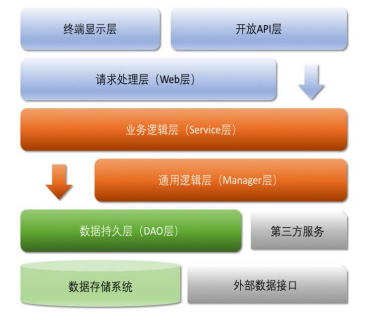

# scaffold-k8s

## 编写目的
帮助公司新来的小伙伴快速上手

## 项目介绍
1. scaffold-common : 公共工程，抽象和实现各类工具，技术要点：自定义异常和错误码，统一返回状态码规则，全局异常处理；
2. scaffold-server-auth : 认证授权，基于Spring Security框架实现的用户认证、token授权，支持Oauth2协议，用户登录校验通过service-user；
3. scaffold-server-gateway : Api网关，技术要点：网关路由配置、SpringDoc在线文档配置、Sentinel限流与熔断；
4. scaffold-service-company : 公司微服务，技术要点：微服务接口定义原则、服务间调用、SpringDoc在线文档配置、文件上传与下载；
5. scaffold-service-company-api : 公司微服务接口，面向其他微服务提供接口依赖；
6. scaffold-service-project : 项目微服务，技术要点：Sharding-jdbc分库分表应用、Redis缓存应用、Spring-AMQP+RabbitMq消息应用、分布式事务；
7. scaffold-service-project-api : 项目微服务接口，面向其他微服务提供接口依赖；
8. scaffold-service-user : 用户微服务，技术要点：服务配置、Nacos配置中心应用、Json数据处理、Mybatis-plus应用；
9. scaffold-service-user-api : 用户微服务接口，面向其他微服务提供接口依赖；
注意：server和service工程均可独立打包部署，每个微服务需要独立配置数据库；
   
## 应用分层
在《Java开发手册》中，阿里巴巴技术团队对应用分层的建议如下图：  
  
本架构面向中小型项目，采用四层架构，即Web层、Rest层、Service层、Dao层  
1. 调用链说明：controller->rest->service->dao；  
2. Web（controller）层：为前端提供接口，返回统一对象{@link ResponseData ResponseData}；
3. Rest（api）层：为controller层和其他微服务提供接口，参数校验，业务逻辑实现，返回DTO对象；
4. Service层：为rest层提供实体类操作接口，封装dao，丰富操作，返回Entity对象；
5. Dao（mapper）层：为service层提供实体类基本CRUD操作，自定义查询，返回Entity对象；

## 开发环境
- 操作系统: Window10 20H2
- 开发工具: Idea 2020.3
- java环境: JDK11
- k8s环境: minikube 1.12.3
- 持续集成: 
- 持续交付: 

## 运行环境及部署
* 运行环境
1. JDK 11.0.8
2. MySQL 8.0.21
3. Redis 6.0.8
4. RabbitMQ 3.8.9
5. Nacos 1.4.0
6. Sentinel 1.8.0
* 命令行启动(windows环境下需要指定编码)
```
java -Dport=8080 -Dfile.encoding=UTF-8 -jar xxx.jar --spring.profiles.active=dev
```

## 打包说明
1. 子模块打包找不到依赖时，先maven install父工程；
2. spring-boot应用中，当有多个类包含main方法时，需要指定一个mainClass；
```xml
    <build>
        <plugins>
            <plugin>
                <groupId>org.springframework.boot</groupId>
                <artifactId>spring-boot-maven-plugin</artifactId>
                <configuration>
                    <mainClass>com.ylwq.scaffold.service.user.UserApplication</mainClass>
                </configuration>
            </plugin>
        </plugins>
    </build>
```
3. spring-boot应用中，既要打可执行包又需要非可执行包的方式；
```xml
    <build>
        <plugins>
            <plugin>
                <groupId>org.springframework.boot</groupId>
                <artifactId>spring-boot-maven-plugin</artifactId>
                <configuration>
                    <classifier>exec</classifier>
                </configuration>
            </plugin>
        </plugins>
    </build>
```

## 版本操作
* 项目全局版本更新  
> 命令：`mvn versions:set -DnewVersion=版本号`  
> 说明：会产生一个旧版本备份文件`pom.xml.versionsBackup`
* 项目全局版本回滚
> 命令：`mvn versions:revert`  
> 说明：恢复`pom.xml.versionsBackup`文件中的版本，回滚完成后自动删除`pom.xml.versionsBackup`文件
* 项目全局版本确认
> 命令：`mvn versions:commit`  
> 说明：确认后会自动删除`pom.xml.versionsBackup`文件

## 问题
* 使用lombok的@Slf4j，但log没有info的方法
> 解决：需要spring-boot依赖  
> ```xml
>         <dependency>
>              <groupId>org.springframework.boot</groupId>
>              <artifactId>spring-boot-starter</artifactId>
>          </dependency>
> ```
* 微服务启动报错误：`Annotation @EnableCircuitBreaker found, but there are no implementations`
> 解决：添加依赖
> ```xml
>         <dependency>
>             <groupId>org.springframework.cloud</groupId>
>             <artifactId>spring-cloud-starter-netflix-hystrix</artifactId>
>         </dependency>
> ```


## 参考
1. [Java开发手册-嵩山版](resource/pdf/Java开发手册-嵩山版.pdf)
1. [Spring Cloud 微服务与 K8S 的协作之道](https://blog.csdn.net/weixin_44388301/article/details/99575907?utm_medium=distribute.pc_relevant.none-task-blog-BlogCommendFromBaidu-5.control&depth_1-utm_source=distribute.pc_relevant.none-task-blog-BlogCommendFromBaidu-5.control)
2. [关于领域模型转换的那些事儿](https://www.jianshu.com/p/a7f56a9b9c33)
3. [ShardingSphere 4.x Sharding-JDBC 用户手册之YAML配置手册](https://my.oschina.net/u/3777515/blog/4450623)
